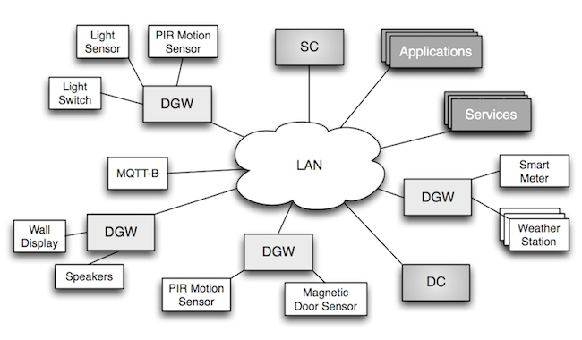
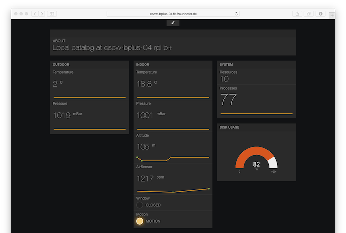
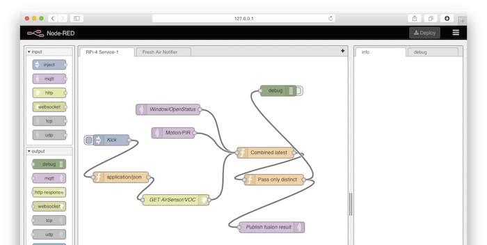

+++
title = "Patchwork Toolkit - Lightweight Platform for the Network of Things"
date = 2014-12-02T18:00:00Z
author = ["Alexandr Krylovskiy", "Oleksandr Lobunets"]
+++

[Patchwork](http://patchwork-toolkit.github.io/) is a toolkit for connecting various devices into a network of things or, in a more broad case - Internet of Things (IoT). The main goal of creating this toolkit is to have a lightweight set of components that can help to quickly integrate different devices (e.g. Arduinos, RaspberryPI’s, Plugwise, etc) into a smart environment and expose specific devices’ capabilities as RESTful/SOAP/CoAP/MQTT/etc services and data streams.

# TL; DR;

Briefly, what that all above and especially further in this article means is shown on the image below.


What the Patchwork toolkit is all about can be expressed simple like this (considering you as a hacker/hobbyist): you take your favourite electronics (bunch of sensors, LED strip, robot-toys, etc), connect them to a pocket-size Linux box, install Patchwork, do some quick configuration and you get RESTful API, data streams using MQTT, directory of your services, discovery in the LAN using Bonjour and _a damn-sexy, open source real-time dashboard_ based on [Freeboard](https://github.com/Freeboard/freeboard). 

All you need is your creativity and just focusing on the implementation of your **idea, not infrastructure!**

# Table of contents

- [Why](#why)
- [Architecture](#architecture)
  - [Overview](#overview)
  - [Device Gateway](#device-gateway)
  - [Discovery of Devices and Services](#discovery-of-devices-and-services)
- [Implementation highlights](#implementation-highlights)
  - [Using Go's standard library](#using-go-standard-library)
  - [Process management](#process-management)
  - [Communication patterns](#communication-patterns)
  - [Logging](#logging)
  - [Dependencies management](#dependencies-management)
  - [Cross-platform builds and deployment](#cross-platform-builds-and-deployment)
- [Usage example](#usage-example)
  - [Dashboard out of the box](#dashboard-out-of-the-box)
  - [Quick prototyping using IBM's NodeRed](#quick-prototyping-using-IBM-NodeRed)
- [Summary and future work](#summary-and-future-work)

# Why
<!--
*  Device integration: access to hardware resources via over the network (e.g., smart home/office scenarios)
*  Applications: discovery and communication with devices/resources
*  Patchwork toolkit: integration through configuration
*  Basic principles: KISS, DRY
-->
 
The Internet of Things (IoT) is causing a hype all over the Internet, yet implementing even basic IoT scenarios like smart home/office today is still challenging. One of the main challenges is to connect IoT devices (sensors, actuators) to the network and provide access to them for applications using common APIs and protocols.

<!--You don't even need to know much about embedded hardware to get started: following the [guides](https://learn.adafruit.com/category/raspberry-pi) and projects done by other people you can build a blinking prototype in just a few hours. In fact, you don't even need to know much about programming for embedded devices either: the same [guides](https://learn.adafruit.com/category/raspberry-pi) will walk you step-by-step through the process and provide with simple python examples and [libraries](https://github.com/adafruit/Adafruit-Raspberry-Pi-Python-Code) that make such prototyping very easy.-->

The IoT devices market is growing, and it is very simple to build your own "sensor platform" for under $100 using a Raspberry Pi and a handful of [sensors](http://www.adafruit.com/categories/35). Once you have things working locally though, you start running into troubles: how to expose these devices on the network? how to discover and access them to build web/mobile applications to monitor and actuate things? At this point, you basically have two options:

1. Write a simple web/ws server and/or setup an [MQTT](http://mqtt.org) broker and publish to it (and hardcode endpoints)
2. Find an existing IoT framework/toolkit and integrate your devices/applications with it

Without going into much details, we got tired of doing 1. over and over again, and couldn't find 2. that would satisfy our expectations in being **simple**, **lightweight**, **easy to deploy and work with**. With these goals in mind, we started creating [Patchwork](http://patchwork-toolkit.github.io/) - a lightweight toolkit for IoT development that offers integration of devices through configuration and provides basic services for zeroconf discovery of resources and services on the network.

# Architecture

## Overview
A bird's-eye-view of the Patchwork architecture is shown in the picture:



Patchwork integrates devices, applications and services with the help of the following components:

* **Device Gateway (DGW)** integrating different IoT devices and exposing their resources on the network via common APIs (REST, MQTT)
* **Device Catalog (DC)** providing a registry of available IoT devices and their capabilities on the network
* **Service Catalog (SC)** providing a registry of available services (MQTT broker, Device Catalog, DB, ...) on the network
 
## Device Gateway

<!--* Process manager: management of agents and stdin/stdout redirection
* Comm services: routing/proxying of requests and data streams
  * Extensible protocols, currently implemented: REST, MQTT
-->
A high-level architecture of the DGW capturing its main modules is shown in the picture:


* **Devices** are IoT devices connected to the DGW host and communicating using their native protocols (Serial, ZigBee, etc) with Device Agents
* **Device Agents** are small programs running on the DGW and communicating through *stdin/stdout* with the Process Manager
* **Process Manager** manages the Device Agents (system processes) and forwards data between them and the communication Services
* **Services** expose the devices managed by Device Agents via common APIs (REST/MQTT) and forward requests/responses and data streams to the applications

Device agents for Patchwork can be implemented in any programming language suitable for integration of a particular device and [example agents](https://github.com/patchwork-toolkit/agent-examples) are provided. Having a device agent, the integration of a new device reduces to describing its capabilities and parameters to the agent and communication protocols in a json configuration file. Using this configuration, the DGW will register the device in the Device Catalog and expose its resources via configured APIs.

## Discovery of Devices and Services

In Patchwork, we distinguish between discovery of network services and IoT devices, which is implemented by the Device and Service catalogs correspondingly. The catalogs serve as registries for both Patchwork components and third-party applications and services and expose RESTful APIs.

Devices integrated with the DGW are automatically registered in its local Device Catalog, which can be used by applications to search for devices with required capabilities/meta-information integrated with that DGW. In addition to that, a network-wide Device Catalog can be configured on DGWs and populated with information about devices connected to them. 

Similarly, Service Catalog provides a registry of services running on the network, and can be used by applications to search for services by meta-information. For example, the network-wide Device Catalog can be registered in the Service Catalog to be discovered by applications.

To enable [zeroconf networking](http://en.wikipedia.org/wiki/Zero-configuration_networking) and discovery of services and IoT devices without manual configuration of the endpoints or IP addresses, we use [DNS-SD](http://dns-sd.org/) discovery and advertise the Service Catalog endpoint on the network. Having discovered the Service Catalog, applications can query it for available services and then search for devices by querying the discovered Device Catalog.


# Implementation highlights

We've chosen Go for implementation for multiple reasons, some of which are described in more details below. Following our basic requirements, we wanted to have *static linking* and *cross-platform builds* for simple deployment on pocket-sized computers and development and testing on multiple platforms. *Performance* and *productivity* also made a great contribution to our choice: targeting at resource-constrained ARM devices, we wanted to have performance comparable to C and productivity comparable to python. Last but not least, it all started as a spare time project and we wanted it to be *fun* to work on.

## Using Go's standard library

As already acclaimed by many, the Go's standard library is very rich and intuitive. Some highlights from our experience:
* `net/http` was very simple to get started building our http and REST APIs and eventually we ended up with using it almost exclusively. We only took the `gorilla/mux` package to have a more straightforward router configuration and recently included `codegangsta/negroni` middleware for future extensions (without changing our handlers as it conforms to the `net/http` Handler)
* `crypto/tls` was surprisingly easy (e.g., compared to Bouncycastle in Java) to configure and use TLS sockets (we used that for MQTT)
* Network stack for implementing (m)dns(-sd)


## Process management

One of the key goals of DGW was executing external programs, which should *talk* to the hardware resources using a low level (close to metal) interfaces and protocols and keep the communication with DGW using *stdin* and *stdout* streams. These external programs can be executed once upon request (task), periodically executed  (timer) or constantly running and producing output (service).

The idea of how to implement such process management came from [Foreman](http://ddollar.github.io/foreman/) - a Procfile-based applications manager. Luckily we found 2 ports of this great developer's tool to Go: [Forego](https://sourcegraph.com/github.com/ddollar/forego) and [Goreman](https://github.com/mattn/goreman). In fact we had the same requirement, but instead of using Procfile we had our JSON-based configuration and the processes had different types of execution.

## Communication patterns

Another challenge in creating DGW was how to implement HTTP request processing pipeline:
 1. RESTful API handler receives _HTTP GET_ request
 2. DGW resolves which agent is exposed under request's URI
 3. DGW invokes a corresponding executable (if it is a _task_) and captures its standard output stream or reads the latest cached value (if it is a _timer_ or a _service_)
 4. DGW returns the value (or an error) back to the HTTP request handler
 5. The handler composes and sends the HTTP response

Or another scenario, which is even more complex:
 1. RESTful API handler receives _HTTP PUT_ request, which requires changing the corresponding hardware resource state (using actuator rather than sensor)
 2. DGW resolves which agent is exposed under request's URI
 3. DGW invokes a corresponding executable (if it is a _task_) and writes received PUT data to its standard input stream, then captures its standard output stream. We do not support writes for _timer_ agent types.
 4. The rest of the steps are similar to steps 4 and 5 in the previous scenario.

This is where [advanced Go concurrency patterns](http://blog.golang.org/advanced-go-concurrency-patterns) help a lot. Good luck synchronizing your threads when writing it in other conventional language! In our implementation each HTTP handler has access to agent manager's _inbox_ channel, which it sends a special request structure to. This special request structure has another channel (read by handler's goroutine) so an agent manager can send execution results back to the handler's goroutine:

```
type AgentManager struct {
    ...
	dataRequestInbox chan DataRequest
    ...
}

type DataRequest struct {
    ...
    Reply      chan AgentResponse
}

dr := DataRequest{
	ResourceId: resourceId,
	Reply:      make(chan AgentResponse),
}
mgr.dataRequestInbox <- dr

repl := <-dr.Reply

```

<!-- * Channels and diverse concurrency patterns -->

## Logging

Similar to other developers coming from other programming languages (Python, Java, etc) we were first uncomfortable having such a ascetic `log` package in the standard library: hey, where are the log levels? 

Disappointed by its  austerity we have tried many of the existing _clones/ports_ packages such as [log4go](https://code.google.com/p/log4go/), [glog](https://github.com/golang/glog) and [go-logging](https://github.com/op/go-logging) but after all came back to the standard `log` and sticked to it for its simplicity. And you know what? We still didn't run into a severe need of having those logging levels and colourful output in the terminal. Just rely on the famous [The Twelve-Factor App methodology](http://12factor.net) (chapter [XI. Logs](http://12factor.net/logs)): do leave the task of implying something from your logs to an external tool (which is already implemented) when it bites you.

## Dependency management

Reproducible builds and development environment has got on our radar when one day we got broken code caused by incompatible changes in the [MQTT package](http://git.eclipse.org/c/paho/org.eclipse.paho.mqtt.golang.git/). Although we were initially skeptical about vendoring, it does provide clear benefits when building distributed systems and shipping code on constrained devices lacking Internet connectivity - scenarios which are very relevant for what we are doing with patchwork.

Looking for dependency management and/or vendoring solution, we evaluated several different tools and approaches. We really liked [GPM](https://github.com/pote/gpm)/[GVP](https://github.com/pote/gvp) for their simplicity, but the only cross-platform solution we found was [godep](https://github.com/tools/godep). We started using godep by simply fixing the dependencies versions in the Godeps.json and eventually switched to vendoring, which allows us to build patchwork without Internet connectivity.

## Cross-platform builds and deployment

Another reason to be happy with Go is a possibility to cross-compile the Go code for different operating systems and processor architectures on the same machine without running a bunch of virtual boxes and custom management of toolchains. Patchwork's binary release process is blazing fast (running on the 2.7 GHz Intel Core i7 with 8 cores / 16 GB RAM MacBook Pro) and creates executables for OSX (amd64), Linux (amd64, arm) and Windows (amd64) running a single command with a help of [Gox](https://github.com/mitchellh/gox), which is _a simple, no-frills tool for Go cross compilation that behaves a lot like standard go build_, _parallelize builds for multiple platforms_ and _also build the cross-compilation toolchain for you_.

# Usage example

Here we would like to share with you how the Patchwork is used and how you can use it at home or in the office. Once you have your IoT infrastructure created with Patchwork, it's up to you which tools, languages, IDEs to use for hacking into your interconnected hardware. We just give you a couple of suggestions here.

## Dashboard out of the box

The dashboard (based on [Freeboard](https://github.com/Freeboard/freeboard)) comes out of the box when you run a DGW. This is the simplest thing you can do - connect the hardware, run the Patchwork, open a dashboard on your wall-mounted screen and configure a monitoring view for your environment.



## Quick prototyping using IBM's NodeRed

Observing the sensors values is fun for the first 2 hours, but later you would definitely get an itch to program something sophisticated. Why not to try a [Visual Programming Paradigm](http://en.wikipedia.org/wiki/Visual_programming_language) in practice and explore a little bit of [Dataflow](http://en.wikipedia.org/wiki/Dataflow_programming) with the help of [IBM's NodeRed](http://nodered.org) - a visual tool for wiring the IoT?

On the screenshots above you can see 2 flows (this is how programs are called in dataflow programming) we have created within minutes using our Patchwork APIs. The first flow it performing data fusion of three sensors: magnetic window opened/closed sensor, PIR motion sensor and Indoor Air Quality (IAQ) sensor. The combined array of 3 values is passed to downstream only when at least once sensor value changes and the array is published to the preconfigured MQTT broker, exposed also as a service using Patchwork's SC (Service Catalog).



On the second flow we subscribe to the sensor data array, published by the flow described above, and evaluate a the following rules:
 * IF air quality is bad (for mental work; using constant threshold) AND window is closed AND there is movement in the office THEN pass the data to downstream
 * otherwise do nothing

 The downstream process composes an english sentence that suggests user to ventilate a room and passes that sentence to a TTS (Text-To-Speech) component and generate a standard OSX desktop notification to inform a user.


# Summary and future work

In this article we have described a [Patchwork](http://patchwork-toolkit.github.io/) software written completely in Go to simplify creation of IoT infrastructures and focus on the actual problem (either research question or a creative idea).

The current version of Patchwork is completely focused on creating a smart environment within a LAN. We are currently exploring different ways to support creation of distributed smart environments and providing different ways of manage data streams and implement services execution between them.

Additionally, we are working on adding support for more service protocols (CoAP, Websockets) and data formats to the DGW and catalogs APIs.